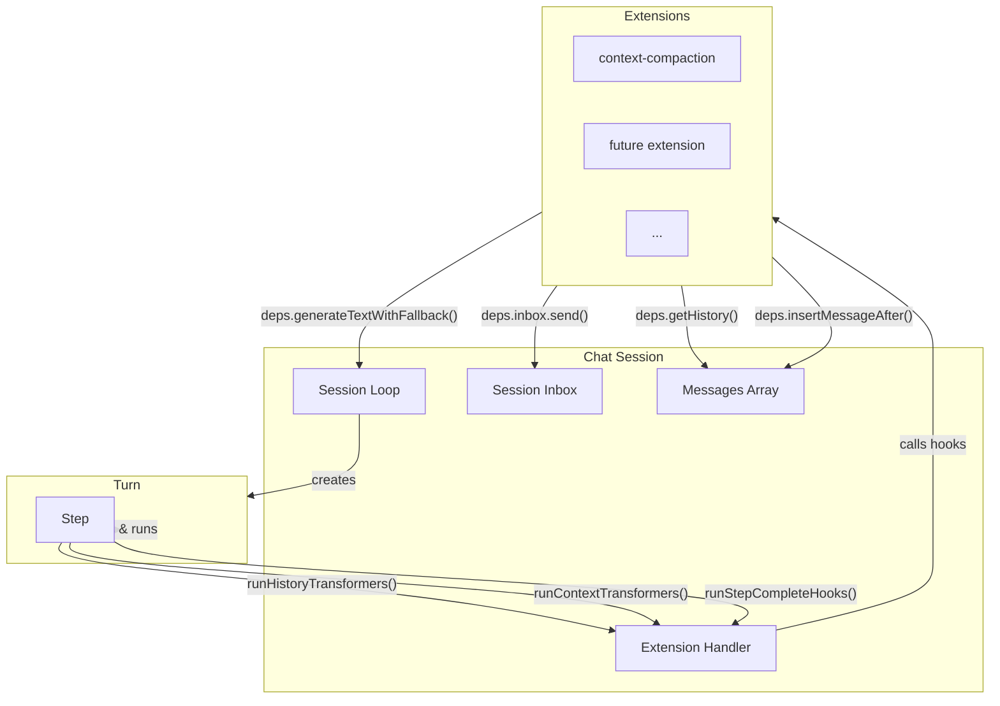
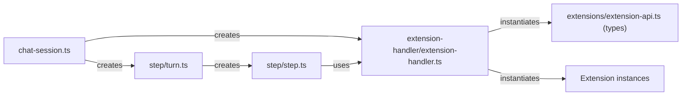
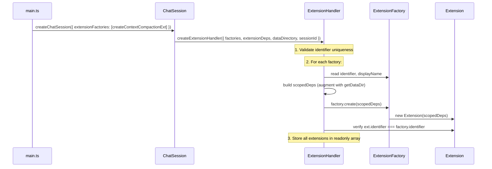
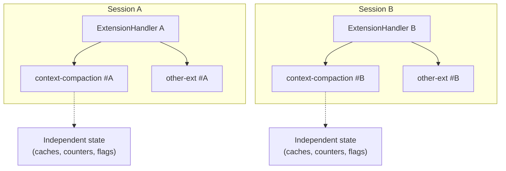
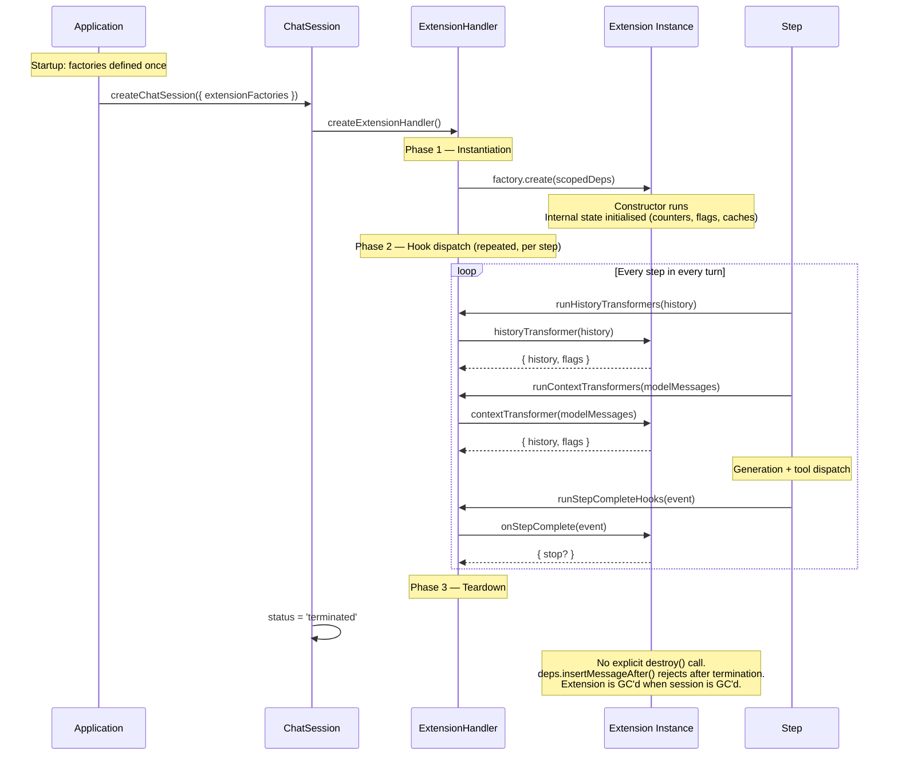
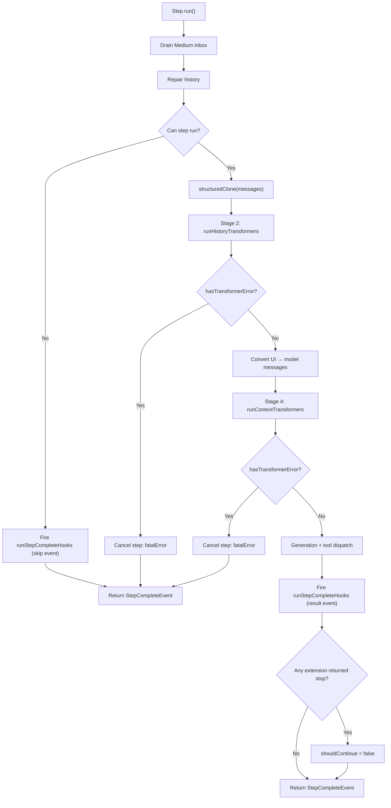

# Extension Architecture

## Overview

The extension system lets external modules observe and transform a chat session's history and context without being embedded in the core step/turn/session pipeline. The `ExtensionHandler` is a sub-module within the session module that mediates between the session lifecycle and all loaded extensions.



The session creates the `ExtensionHandler` at construction time, passing it the session-scoped dependencies (`getHistory`, `insertMessageAfter`, `inbox`, `config`, `generateTextWithFallback`, `logger`). The handler then instantiates each extension from its factory, augments the deps with a per-extension `getDataDir`, and exposes three hook dispatchers plus a data-part transformer collector.

The handler is passed **by reference** through the turn to the step. The step calls the dispatchers at specific points in its pipeline. Extensions never interact with the session directly — they go through the deps the handler gave them.

## Module Hierarchy



The handler lives at `session/chat/extension-handler/`. The extension API types live at `session/chat/extensions/extension-api.ts`. Concrete extensions live in sibling folders under `session/chat/extensions/`.

## Extension Identity

Every extension has a unique **identifier** in reverse-domain notation (e.g. `"io.stagewise/context-compaction"`). This is a machine-readable ID, not a human-readable label. The handler enforces uniqueness at registration time — duplicate identifiers throw before any extension is instantiated.

The optional `displayName` field covers the human-facing label shown in UIs and logs.

> **Why `identifier` and not `name`?** The reverse-domain string is a unique machine ID (`"io.stagewise/context-compaction"`). Calling it `name` would conflate it with a human-readable display label. The current split — `identifier` (machine) + `displayName` (human) — keeps the two concerns cleanly separated.

The handler also verifies that the factory's `identifier` matches the created extension's `identifier`. A mismatch throws immediately.

## What an Extension Looks Like

An extension is defined by two objects: a **factory** and an **instance**.

```typescript
import type {
  Extension,
  ExtensionDeps,
  ExtensionFactory,
} from '@/session/chat/extensions/extension-api';

class MyExtension implements Extension {
  readonly identifier = 'io.example/my-extension';
  readonly displayName = 'My Extension';

  constructor(private readonly deps: ExtensionDeps) {}

  // Optional: transform UI messages before model conversion.
  historyTransformer(history) {
    return history; // or { history, flags: { hasCompacted: true } }
  }

  // Optional: transform model messages after conversion.
  contextTransformer(history) {
    return history;
  }

  // Optional: observe every step completion.
  async onStepComplete(event) {
    // Can return { stop: true, stopReason: '...' } to halt the turn.
  }

  // Optional: convert custom UI data parts to model content.
  dataPartTransformers = {
    'my-custom-type': (data) => [{ type: 'text', text: data.value }],
  };
}

export const createMyExtension: ExtensionFactory = {
  identifier: 'io.example/my-extension',
  displayName: 'My Extension',
  create: (deps) => new MyExtension(deps),
};
```

All hooks are optional. An extension can implement any subset.

### Extension Dependencies (`ExtensionDeps`)

The session provides each extension with these dependencies:

| Dep | Purpose |
|-----|---------|
| `getHistory()` | Returns a copy of the current session messages. |
| `insertMessageAfter(id, msg)` | Mutates the live history array — inserts a message after the one with the given ID. Returns `false` if not found or session is terminated. |
| `inbox` | The session inbox — send buffered messages or context events for the next turn. |
| `config` | Application config (model selections, providers, etc.). |
| `generateTextWithFallback(args)` | Generates text via model fallback, routed through the session for usage tracking. Returns `string \| null`. |
| `logger` | Module-scoped logger for the extension. |
| `getDataDir(global?)` | Returns an absolute path to a per-extension storage directory. `global=false` → session-scoped; `global=true` → agent-wide. Directory is **not** guaranteed to exist — the extension must create it. |

## Data Directories

Each extension has access to two storage directories, provided via `deps.getDataDir()`:

| Scope | Path | When to use |
|-------|------|-------------|
| **Session-scoped** (default) | `{agentDataDir}/sessions/{sessionId}/extensions/{identifier}/` | State that is specific to one session — e.g. cached compaction thresholds, per-session token counters. |
| **Agent-wide** (`global=true`) | `{agentDataDir}/extensions/{identifier}/` | State shared across all sessions — e.g. model preferences, cached configs, learned thresholds. |

```text
{agentDataDir}/
├── extensions/
│   └── io.stagewise/context-compaction/    ← agent-wide (global)
│       └── ... (shared across all sessions)
└── sessions/
    └── {sessionId}/
        └── extensions/
            └── io.stagewise/context-compaction/  ← session-scoped
                └── ... (isolated per session)
```

Neither directory is guaranteed to exist — the extension must create it (e.g. `fs.mkdirSync(path, { recursive: true })`) before writing.

## Registration & Instantiation



The handler enforces two invariants before any hook runs:
1. **No duplicate identifiers** across factories.
2. **Factory identifier matches instance identifier.**

## Extension Lifecycle

### One instance per session

Each session creates its own `ExtensionHandler`, which instantiates a **fresh instance of every extension** for that session. There is no shared extension instance across sessions. If two sessions run concurrently, each has its own set of extension objects with independent internal state.



The factories themselves are singletons — defined once at application startup in `main.ts` and passed to every `createChatSession` call. But `factory.create(deps)` is called once per session, producing a new instance each time.

### Lifecycle phases



### Phase 1 — Instantiation

Happens once, during `ChatSession` construction. The handler validates identifiers, builds per-extension scoped deps (including `getDataDir`), and calls `factory.create(scopedDeps)`. The extension constructor receives its deps and should initialise all internal state here. No hooks are called during this phase.

### Phase 2 — Hook dispatch

This is the steady state. The session loop creates turns, turns create steps, and each step calls the handler's dispatchers at specific pipeline points. Extensions may be called many times across many steps and turns. This phase runs for the entire lifetime of the session.

### Phase 3 — Teardown

There is no explicit `destroy()` or `cleanup()` hook. When the session terminates:

- `deps.insertMessageAfter()` starts returning `false` — outstanding async extension tasks (e.g. in-flight compaction) can no longer mutate the session's history.
- The extension instance is eligible for garbage collection once the session and handler are dereferenced.

Extensions that hold resources (file handles, timers, intervals) should clean them up reactively — e.g. by detecting that `insertMessageAfter` returns `false` or by tracking session status via `deps.config`.

## Hook Dispatch

The handler exposes four methods. Each is called at a specific point in the step pipeline.

### When Hooks Fire



### `runHistoryTransformers(history)`

**When:** Stage 2 of the step pipeline — after history copy, before UI-to-model conversion.

**How:** Extensions are called **sequentially** in registration order. Each receives the output of the previous extension. This is a pipeline — the output of one feeds the input of the next.

**Error handling:** If a transformer throws, the error is caught, logged with the extension identifier, and the pipeline continues with the current history **unchanged** (the failing extension's transformation is skipped). The `hasTransformerError` flag is set in the returned `TransformationFlags`.

**Step cancellation:** If `hasTransformerError` is set, the step is cancelled with `fatalError: true` before generation. Context integrity cannot be guaranteed after a transformer failure.

**Return:** `{ history, flags }` where flags are merged across all extensions with OR semantics (`hasCompacted`, `hasTransformerError`).

### `runContextTransformers(history)`

**When:** Stage 4 of the step pipeline — after UI-to-model conversion, before generation.

**How:** Same sequential pipeline as history transformers, but operates on `ModelMessage[]` instead of `ExtendedUIMessage[]`.

**Error handling & cancellation:** Identical to `runHistoryTransformers`.

### `runStepCompleteHooks(event)`

**When:** After every step completes — whether it was **skipped**, **cancelled** (transformer error), **succeeded**, or **failed**. This is guaranteed: the step always fires this hook before returning.

**How:** All extensions' `onStepComplete` hooks are called **in parallel** via `Promise.allSettled`. Each receives a `structuredClone` of the `StepCompleteEvent` — mutations cannot leak to other extensions or back to the caller.

**Error handling:** If a hook throws (synchronously or asynchronously), the error is caught and logged. One extension's failure does **not** break other hooks — all hooks are guaranteed to run. Hook errors do **not** cancel the step.

**Stop signal:** If any extension returns `{ stop: true, stopReason }`, the returned object has `stop: true` and the first non-empty `stopReason`. The step sets `shouldContinue = false` on its result event, halting the turn.

**Return:** `{ stop: boolean; stopReason: string | null }`.

### `getDataPartTransformers()`

**When:** Called during message conversion (UI → model). Not a hook — a synchronous collector.

**How:** Iterates all extensions and merges their `dataPartTransformers` into a single map. If two extensions register a transformer for the same data part type, the handler throws at call time — only one converter per type is allowed.

## The `StepCompleteEvent`

Every step — regardless of outcome — returns a `StepCompleteEvent` and fires `runStepCompleteHooks` with it:

```typescript
interface StepCompleteEvent {
  shouldContinue: boolean;      // Should the turn run another step?
  forceNextStep: boolean;       // Must inject "Continue." before next step?
  fatalError: boolean;          // Non-recoverable error → terminate session
  fatalErrorReason: string | null;
  generationFailed: boolean;    // Generation attempted, all retries exhausted
  generation: GenerationInfo | null;  // null when no generation happened
  toolCalls: ToolCallInfo[];    // Tool calls dispatched & settled, empty if none
}
```

`generation` is `null` for skipped steps, cancelled steps (transformer errors), and fatal errors. When present, it includes `modelId`, `finishReason`, and full `LanguageModelUsage` (including cache/reasoning details).

## Summary of Error Isolation

| Hook type | Dispatch | One extension throws | Effect on others | Effect on step |
|-----------|----------|---------------------|-------------------|----------------|
| `historyTransformer` | Sequential pipeline | Caught, logged, skipped | Next extension gets unchanged history | Step cancelled (`fatalError`) |
| `contextTransformer` | Sequential pipeline | Caught, logged, skipped | Next extension gets unchanged history | Step cancelled (`fatalError`) |
| `onStepComplete` | Parallel (`allSettled`) | Caught, logged | Other hooks unaffected | No effect — step already done |

The core principle: **every extension gets called, no matter what**. For transformers, the error is contained but the step is cancelled because context integrity is uncertain. For callbacks, the error is contained and the step proceeds normally — callbacks are observers.
