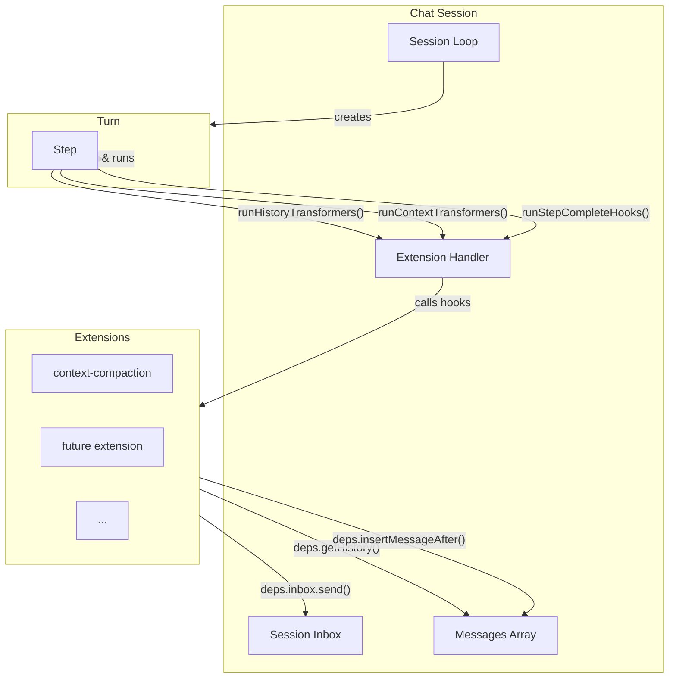
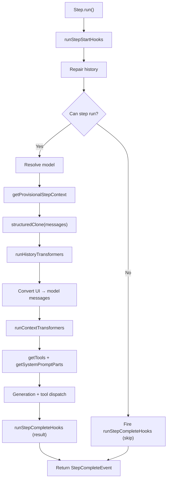

# Extension Architecture

## Overview

The extension system lets external modules observe and transform a chat session's history and context without being embedded in the core step/turn/session pipeline. The `ExtensionHandler` mediates between the session lifecycle and all loaded extensions.



The session creates the `ExtensionHandler` at construction time, passing it session-scoped dependencies. The handler instantiates each extension from its factory, augments the deps with a per-extension `getDataDir`, and exposes hook dispatchers plus a data-part transformer collector.

The handler is passed by reference through the turn to the step. The step calls the dispatchers at specific points in its pipeline. Extensions never interact with the session directly — they go through the deps the handler gave them.

## Extension identity

Every extension has a unique **identifier** in reverse-domain notation (e.g. `"io.stagewise/context-compaction"`). This is a machine-readable ID, not a human-readable label. The handler enforces uniqueness at registration time — duplicate identifiers throw before any extension is instantiated.

The optional `displayName` field covers the human-facing label shown in UIs and logs.

## Extension interface

An extension is defined by a **factory** and an **instance**:

```typescript
class MyExtension implements Extension {
  readonly identifier = 'io.example/my-extension';
  readonly displayName = 'My Extension';

  constructor(private readonly deps: ExtensionDeps) {}

  historyTransformer(history) { return history; }
  contextTransformer(history) { return history; }
  async onStepComplete(event) {}
  dataPartTransformers = {
    'my-custom-type': (data) => [{ type: 'text', text: data.value }],
  };
}

export const createMyExtension: ExtensionFactory = {
  identifier: 'io.example/my-extension',
  displayName: 'My Extension',
  create: (deps) => new MyExtension(deps),
};
```

All hooks are optional. An extension can implement any subset.

### Extension dependencies

| Dep | Purpose |
|-----|---------|
| `getHistory()` | Returns a copy of the current session messages. |
| `insertMessageAfter(id, msg)` | Mutates the live history array — inserts a message after the one with the given ID. Returns `false` if not found or session is terminated. |
| `inbox` | The session inbox — send buffered messages or context events. |
| `config` | Application config. |
| `generateText(args)` | Generates text via model fallback, routed through the session for usage tracking. Returns a discriminated union — `{ success: true, text, modelId, usage }` or `{ success: false, failureReason }`. |
| `logger` | Module-scoped logger. |
| `getDataDir(global?)` | Returns a per-extension storage directory. `global=false` → session-scoped; `global=true` → agent-wide. Not guaranteed to exist — the extension must create it. |

## Data directories

| Scope | Path | When to use |
|-------|------|-------------|
| **Session-scoped** (default) | `{agentDataDir}/sessions/{sessionId}/extensions/{identifier}/` | State specific to one session. |
| **Agent-wide** (`global=true`) | `{agentDataDir}/extensions/{identifier}/` | State shared across all sessions. |

Neither directory is guaranteed to exist — the extension must create it before writing.

## Lifecycle

### One instance per session

Each session creates its own `ExtensionHandler`, which instantiates a fresh instance of every extension for that session. There is no shared extension instance across sessions. The factories themselves are singletons — defined once at application startup and passed to every `createChatSession` call. But `factory.create(deps)` is called once per session, producing a new instance each time.

### Phases

1. **Instantiation** — during `ChatSession` construction. The handler validates identifiers, builds per-extension scoped deps, and calls `factory.create()`. No hooks are called.
2. **Hook dispatch** — steady state. The session loop creates turns, turns create steps, and each step calls the handler's dispatchers at specific pipeline points. This runs for the entire lifetime of the session.
3. **Teardown** — `onClose` is called when the session closes. Extensions that hold resources (file handles, timers) should acquire them in `onStart` and release them in `onClose`. When the session terminates, `deps.insertMessageAfter()` starts returning `false`.

## Hook dispatch

The handler exposes lifecycle methods (`start`, `close`) called by the session, and pipeline dispatchers called by the step:

- `runStepStartHooks` — before history repair
- `runHistoryTransformers` — after history copy, before UI-to-model conversion
- `runContextTransformers` — after UI-to-model conversion, before generation
- `getProvisionalStepContext` — after model resolution, before the history transformation pipeline
- `getTools` / `getSystemPromptParts` — before generation, after model resolution
- `getDataPartTransformers` — during message conversion
- `runStepCompleteHooks` — after every step, including skips and cancellations



### `runHistoryTransformers(history)`

After history copy, before UI-to-model conversion. Extensions are called **sequentially** in registration order — a pipeline where each receives the output of the previous. If a transformer throws, the error is caught, logged, and re-thrown; the pipeline aborts immediately. The step catches the re-thrown error and cancels with `fatalError: true` — the session terminates gracefully because transformer failures are deterministic.

### `runContextTransformers(history)`

After UI-to-model conversion, before generation. Same sequential pipeline and error handling as history transformers, but operates on `ModelMessage[]`.

### `runStepCompleteHooks(event)`

After every step completes — skipped, cancelled, succeeded, or failed. All extensions' `onStepComplete` hooks are called **in parallel** via `Promise.allSettled`. Each receives a `structuredClone` of the event — mutations cannot leak. If a hook throws, the error is caught and logged; one extension's failure does not break other hooks. Hook errors do not cancel the step.

### `getDataPartTransformers()`

Called during message conversion. Iterates all extensions and merges their `dataPartTransformers` into a single map. If two extensions register a transformer for the same data part type, the handler throws at call time — only one converter per type is allowed.

## Error isolation

| Hook type | Dispatch | One extension throws | Effect on others | Effect on step |
|-----------|----------|---------------------|-------------------|----------------|
| `historyTransformer` | Sequential pipeline | Caught, logged, re-thrown | Pipeline aborts | Step cancelled (`fatalError`) |
| `contextTransformer` | Sequential pipeline | Caught, logged, re-thrown | Pipeline aborts | Step cancelled (`fatalError`) |
| `onStepComplete` | Parallel (`allSettled`) | Caught, logged | Other hooks unaffected | No effect |

**Transformer failures are fatal to the session; callback failures are contained.** Transformers are pure data transformations with no transient failure modes, so retrying identical inputs would produce the same error. Callbacks are observers — their failures must not affect control flow.
