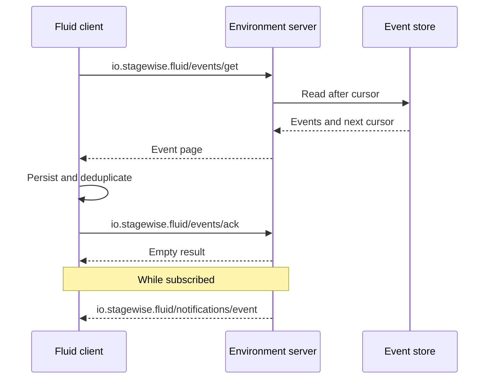

# Overview

Fluid Events is an extension to the Model Context Protocol. It gives an MCP
server a durable feed for events such as process failures, user messages, and
environment state changes.

**Extension identifier:** `io.stagewise.fluid/events`

## Why Fluid Events?

Ordinary MCP notifications are tied to a live connection. They do not establish
whether a message was stored, processed, or lost during a disconnect. Fluid
Events adds the small amount of state needed for reliable delivery:

- stable event identifiers for deduplication;
- cursor-based retrieval after startup or reconnection;
- explicit acknowledgement after durable client acceptance;
- optional push delivery over an MCP subscription.

## Delivery model

The server makes an event retrievable before exposing it to the client. The
client persists an event before acknowledging it. Either peer may retry, so the
client treats `eventId` as the idempotency key.

## Progressive enhancement

Both peers declare `io.stagewise.fluid/events` in their MCP extension
capabilities. A server may push events only when the client has declared support
and opened a subscription. A client can use retrieval without subscribing.

See [the specification](./specification/draft/events.md) for message shapes and
normative behavior.
