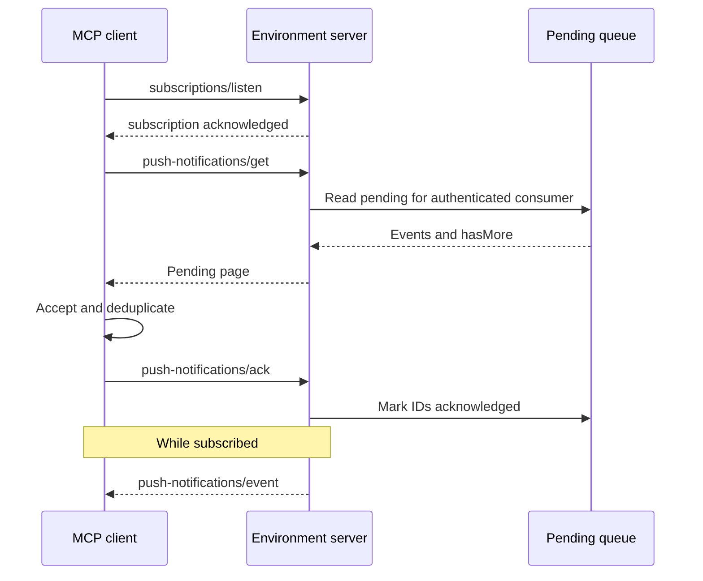

# Overview

Push Notifications is an MCP extension for reliable user messages, process failures, and environment changes. Each authenticated logical consumer has a server-managed queue of pending notifications.

**Extension identifier:** `io.stagewise/push-notifications`

## Why Push Notifications?

Ordinary MCP notifications exist only on a live connection. Push Notifications adds:

- stable event identifiers for at-least-once deduplication;
- server-managed pending retrieval after startup or reconnection;
- explicit acknowledgement after durable client acceptance;
- optional low-latency delivery over an MCP subscription.

## Delivery model

The server stores before publishing. The client accepts before acknowledging. Retries can redeliver an event, so `eventId` is the idempotency key. This is a durable consumer queue, not a replayable historical event log.

## Progressive enhancement

Both peers declare `io.stagewise/push-notifications` in their MCP extension capabilities. A server pushes only when the client declared support and opened a subscription. A client can use pending retrieval without subscribing.

See [the specification](./specification/draft/events.md) for message shapes and normative behavior.